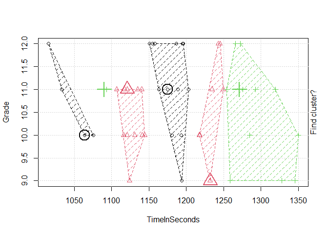
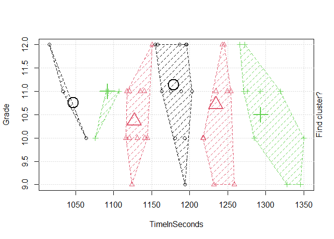
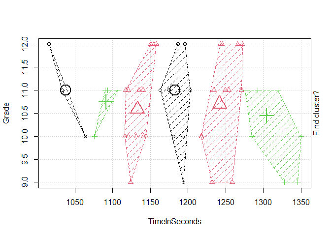
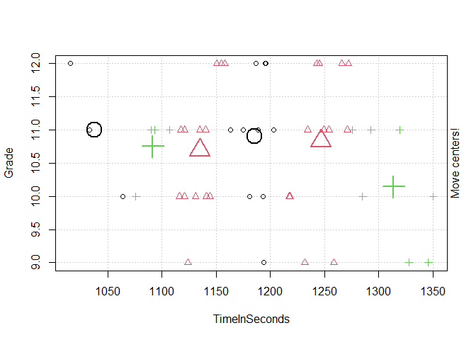
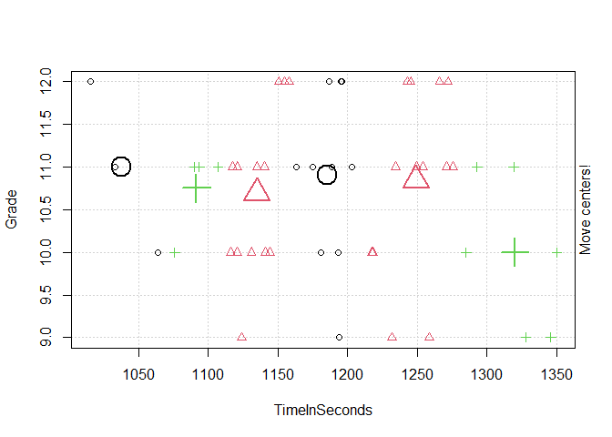
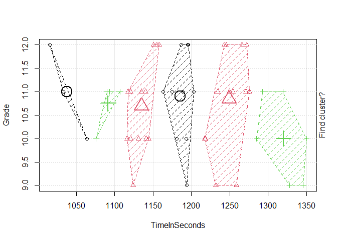

# Clancy Andrews

# Personal Project

# Fall 2021

## Motivation:

I am using the 2021 Caribou Trail High School Cross Country League
rankings as the data set for this project. I chose this data set because
I have a strong love for running and competitive racing. In high school
I competed in cross country not just at the state level, but at the
national level (and had the opportunity to compete internationally).
During those four years, I had a strong motivation to improve and
compete. The data set I am presenting is the same type of set that is
updated throughout the nation on the high school level. Every night,
when I got home after a race, I would be able to see my results and
track my improvements not just against myself, but other people too.
Once high school ended, my love of running still goes on and I am still
able to see my younger teammates and competitors improve through the
same online database.

## Data Process:

I got the data from Athletic.net, a cross country and track & field
database (
<https://www.athletic.net/CrossCountry/Division/List.aspx?DivID=61478>
). The database I used does not have a proper method of exporting the
data, so I had to manually extract the top 50 individuals in the league.
The data that I extracted was fairly small and clean as it was, so there
was no need for cleaning. Working with the data, I had a couple of
integer value data types that helped with visualization and analysis.
The hardest part about the data was that to answer a majority of the
questions, I had to convert the times, that were a string data type, to
a numeric float data type. That process took a while with some trial and
error.

## Visualization:

The first image is a scatter plot of the league rankings versus the time
in seconds of each competitor. There is a gradual, linear pattern in the
middle of the plot but at the top and end ranked runners, the curve
becomes more exaggerated. This is due to the top and end ranked runners
having different levels of endurance and speed, resulting in a larger
gap of time between them and the next runner.

The second image is a box plot of the times for the runners versus the
grade levels of the runners. I found this plot interesting. By
observation, we see that a majority of the runners in grade 10 and 11
are widely distributed in terms of how fast they can run the race. We
can see that grade 9 runners are naturally slower overall (due to body
maturity and experience). The most interesting observation is that grade
12 runners are more tightly distributed and are slower overall, compared
to the other grade levels.

## Analysis:

I applied k-means clustering to my data because it can effectively
display the cluster of runners based on there time and grade level. From
first glance, you can see that the faster the athlete is, less likely
they are to be younger, i.e., grade 9. You can also see that a majority
of the faster clustered runners are grade 11 and 12 and a majority of
the runners in the league are grade in grades 10 and 11. A major
differentiation between great runners and good runners in the high
school setting is if the individual can break the 20 minute mark for the
5000 meters (1200 seconds). When observing the clusters, I have noticed
that a majority of the runners who are around the 20 minute mark are
older. There is also evidence to show which people are more likely to
succeed in the future. This can be seen by the cluster second most from
the left.
